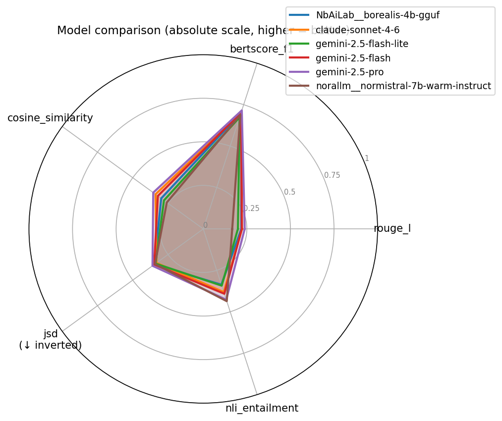
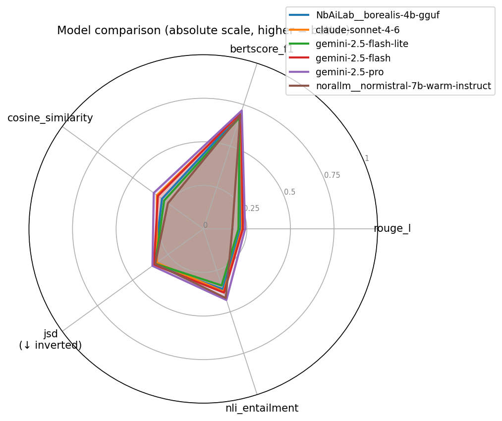
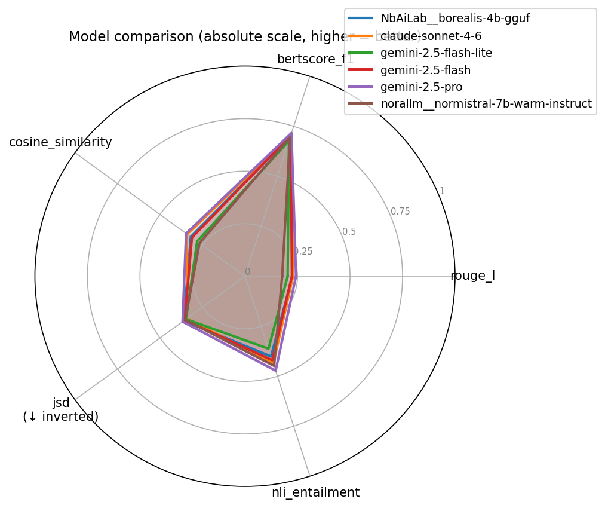
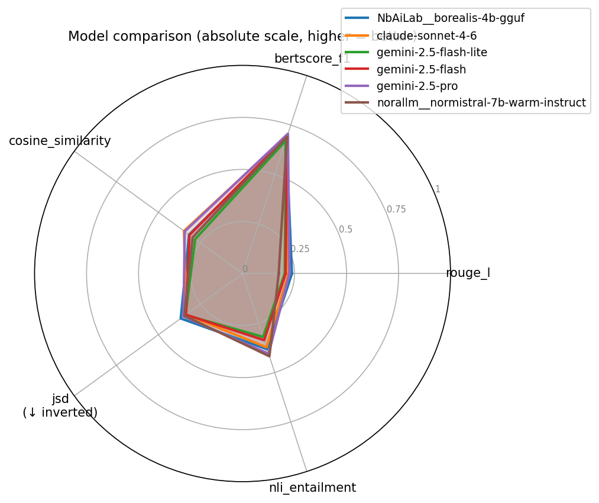
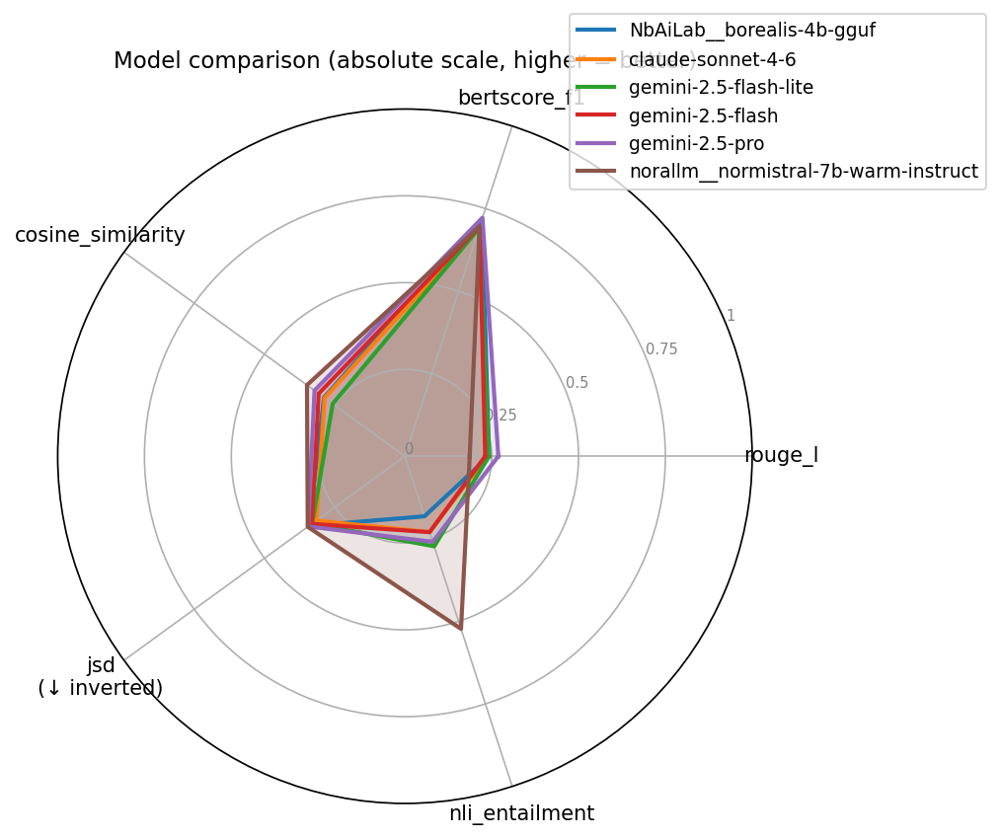

# GAVELbench Evaluation Report

_Generated: 2026-06-11 08:29 UTC_

## Results

| Metric | claude-sonnet-4-6 | gemini-2.0-flash | gemini-2.5-flash | gemini-2.5-pro | norallm__normistral-7b-warm-instruct |
| --- | ---: | ---: | ---: | ---: | ---: |
| pairs evaluated | n=60 | n=60 | n=60 | n=60 | n=60 |
| rouge_l | 0.2228 | 0.2260 | 0.2494 ★ | 0.2395 | 0.2174 |
| bertscore_f1 | 0.7002 | 0.7046 | 0.7105 | 0.7200 ★ | 0.7100 |
| cosine_similarity | 0.3404 | 0.3336 | 0.3574 | 0.3618 ★ | 0.3235 |
| jsd ↓ | 0.6688 | 0.6476 | 0.6388 | 0.6384 | 0.6360 ★ |
| nli_entailment | 0.3429 | 0.3402 | 0.3412 | 0.3558 | 0.4260 ★ |

## Radar Plot

## Resultater per overkategori

### Andre (claude-sonnet-4-6: n=10, gemini-2.0-flash: n=10, gemini-2.5-flash: n=10, gemini-2.5-pro: n=10, norallm__normistral-7b-warm-instruct: n=10)

### Arbeid (claude-sonnet-4-6: n=10, gemini-2.0-flash: n=10, gemini-2.5-flash: n=10, gemini-2.5-pro: n=10, norallm__normistral-7b-warm-instruct: n=10)

### Familie og barn (claude-sonnet-4-6: n=10, gemini-2.0-flash: n=10, gemini-2.5-flash: n=10, gemini-2.5-pro: n=10, norallm__normistral-7b-warm-instruct: n=10)

### Helse og sykdom (claude-sonnet-4-6: n=10, gemini-2.0-flash: n=10, gemini-2.5-flash: n=10, gemini-2.5-pro: n=10, norallm__normistral-7b-warm-instruct: n=10)

### Pensjon (claude-sonnet-4-6: n=10, gemini-2.0-flash: n=10, gemini-2.5-flash: n=10, gemini-2.5-pro: n=10, norallm__normistral-7b-warm-instruct: n=10)

### Sosiale tjenester og veiledning (claude-sonnet-4-6: n=10, gemini-2.0-flash: n=10, gemini-2.5-flash: n=10, gemini-2.5-pro: n=10, norallm__normistral-7b-warm-instruct: n=10)

## Commentary

- **rouge_l**: `gemini-2.5-flash` scores best (0.2494), `norallm__normistral-7b-warm-instruct` scores worst (0.2174). Δ=0.0320 (higher is better).
- **bertscore_f1**: `gemini-2.5-pro` scores best (0.7200), `claude-sonnet-4-6` scores worst (0.7002). Δ=0.0198 (higher is better).
- **cosine_similarity**: `gemini-2.5-pro` scores best (0.3618), `norallm__normistral-7b-warm-instruct` scores worst (0.3235). Δ=0.0383 (higher is better).
- **jsd**: `norallm__normistral-7b-warm-instruct` scores best (0.6360), `claude-sonnet-4-6` scores worst (0.6688). Δ=0.0328 (lower is better).
- **nli_entailment**: `norallm__normistral-7b-warm-instruct` scores best (0.4260), `gemini-2.0-flash` scores worst (0.3402). Δ=0.0858 (higher is better).

**Overall**: `gemini-2.5-pro` leads on 2 of 5 metric(s).
