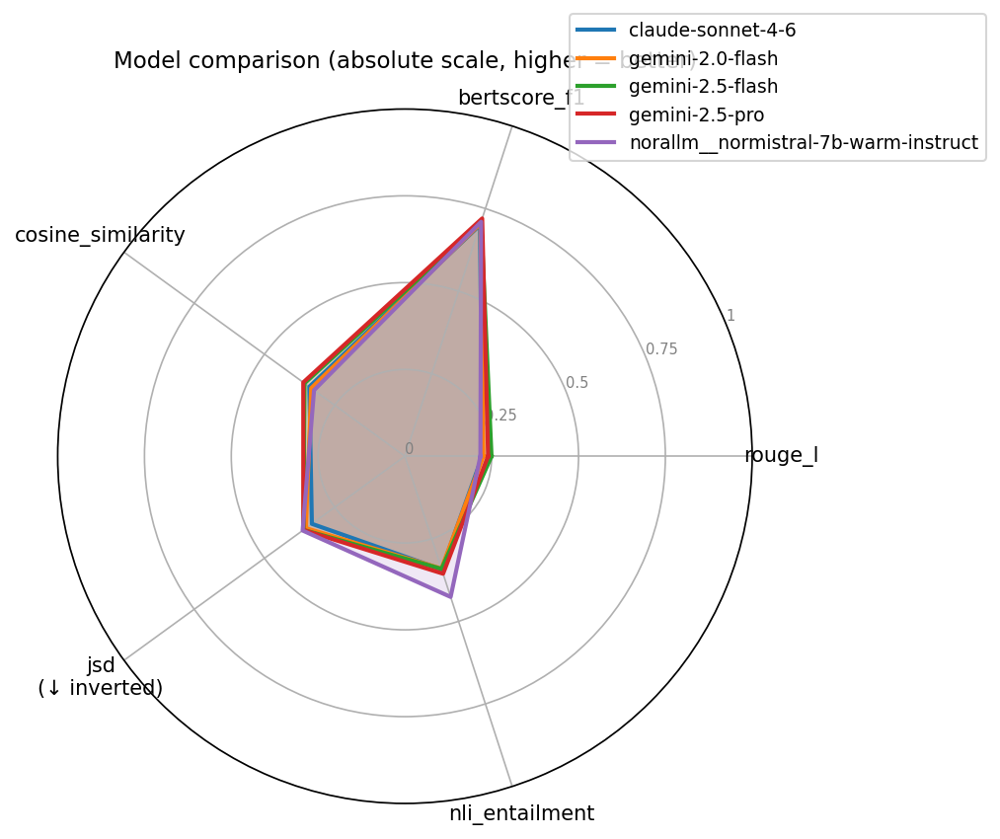

---
# Denne filen er autogenerert av src/report.py — ikke rediger manuelt
---

# Evaluering av språkmodeller opp mot Bob-svar

_Generert: 2026-06-11 08:53 UTC_

Denne rapporten sammenligner språkmodeller mot svar fra Bob på tvers av ulike målemetoder.

## Resultater

| Metrikk | claude-sonnet-4-6 | gemini-2.0-flash | gemini-2.5-flash | gemini-2.5-pro | norallm__normistral-7b-warm-instruct |
| --- | ---: | ---: | ---: | ---: | ---: |
| Antall par | n=60 | n=60 | n=60 | n=60 | n=60 |
| rouge_l | 0.2228 | 0.2260 | 0.2494 ★ | 0.2395 | 0.2174 |
| bertscore_f1 | 0.7002 | 0.7046 | 0.7105 | 0.7200 ★ | 0.7100 |
| cosine_similarity | 0.3404 | 0.3336 | 0.3574 | 0.3618 ★ | 0.3235 |
| jsd ↓ | 0.6688 | 0.6476 | 0.6388 | 0.6384 | 0.6360 ★ |
| nli_entailment | 0.3429 | 0.3402 | 0.3412 | 0.3558 | 0.4260 ★ |

## Radarplot

