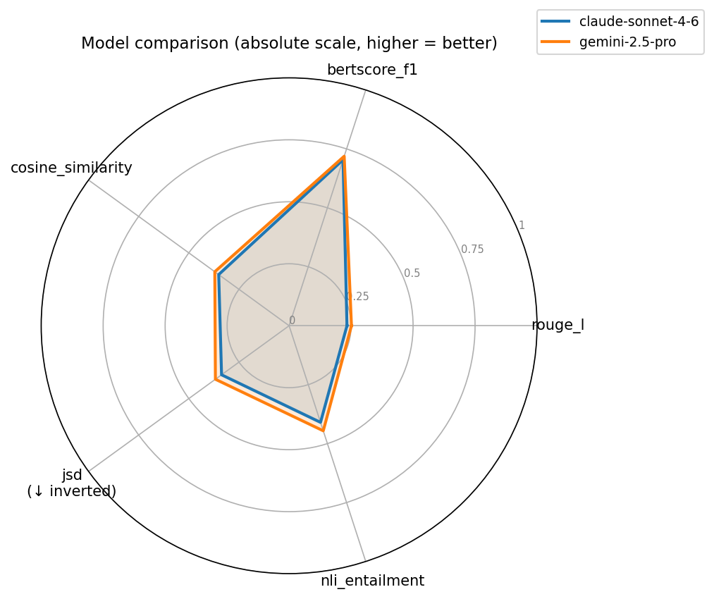

---
# Denne filen er autogenerert av src/report.py — ikke rediger manuelt
---

# Evaluering av språkmodeller opp mot Bob-svar

_Generert: 2026-06-25 13:45 UTC_

Denne rapporten sammenligner språkmodeller mot svar fra Bob på tvers av ulike målemetoder.

## Resultater

| Metrikk | claude-sonnet-4-6 | gemini-2.5-pro |
| --- | ---: | ---: |
| Antall par | n=166 | n=166 |
| rouge_l | 0.2334 | 0.2515 ★ |
| bertscore_f1 | 0.7040 | 0.7188 ★ |
| cosine_similarity | 0.3511 | 0.3705 ★ |
| jsd ↓ | 0.6632 | 0.6326 ★ |
| nli_entailment | 0.4100 | 0.4457 ★ |

## Radarplot

