---
# Denne filen er autogenerert av src/report.py — ikke rediger manuelt
---

# Resultater per kategori

_Generert: 2026-06-11 08:53 UTC_

Denne siden viser evalueringsresultater gruppert etter **overkategori**.
Spørsmål kan tilhøre flere overkategorier, og inngår i beregningene for hver av dem.

## Tabeller per metrikk

### rouge_l

| Overkategori | claude-sonnet-4-6 | gemini-2.0-flash | gemini-2.5-flash | gemini-2.5-pro | norallm__normistral-7b-warm-instruct |
| --- | ---: | ---: | ---: | ---: | ---: |
| Andre | 0.2153 (n=10) | 0.2346 (n=10) ★ | 0.2317 (n=10) | 0.2330 (n=10) | 0.1598 (n=10) |
| Arbeid | 0.2553 (n=10) | 0.2522 (n=10) | 0.2491 (n=10) | 0.2765 (n=10) ★ | 0.2037 (n=10) |
| Familie og barn | 0.2157 (n=10) | 0.2747 (n=10) ★ | 0.2443 (n=10) | 0.2362 (n=10) | 0.2527 (n=10) |
| Helse og sykdom | 0.1899 (n=10) | 0.1460 (n=10) | 0.2181 (n=10) | 0.2254 (n=10) ★ | 0.1866 (n=10) |
| Pensjon | 0.2232 (n=10) | 0.2086 (n=10) | 0.3218 (n=10) ★ | 0.1969 (n=10) | 0.3151 (n=10) |
| Sosiale tjenester og veiledning | 0.2372 (n=10) | 0.2400 (n=10) | 0.2312 (n=10) | 0.2690 (n=10) ★ | 0.1866 (n=10) |

### bertscore_f1

| Overkategori | claude-sonnet-4-6 | gemini-2.0-flash | gemini-2.5-flash | gemini-2.5-pro | norallm__normistral-7b-warm-instruct |
| --- | ---: | ---: | ---: | ---: | ---: |
| Andre | 0.7102 (n=10) | 0.7182 (n=10) | 0.7228 (n=10) | 0.7249 (n=10) ★ | 0.6968 (n=10) |
| Arbeid | 0.7082 (n=10) | 0.7209 (n=10) | 0.7188 (n=10) | 0.7336 (n=10) ★ | 0.7022 (n=10) |
| Familie og barn | 0.7069 (n=10) | 0.7148 (n=10) | 0.7173 (n=10) | 0.7215 (n=10) | 0.7297 (n=10) ★ |
| Helse og sykdom | 0.6971 (n=10) | 0.6621 (n=10) | 0.6869 (n=10) | 0.7136 (n=10) ★ | 0.6959 (n=10) |
| Pensjon | 0.6868 (n=10) | 0.6948 (n=10) | 0.7211 (n=10) | 0.7038 (n=10) | 0.7390 (n=10) ★ |
| Sosiale tjenester og veiledning | 0.6919 (n=10) | 0.7166 (n=10) | 0.6960 (n=10) | 0.7224 (n=10) ★ | 0.6963 (n=10) |

### cosine_similarity

| Overkategori | claude-sonnet-4-6 | gemini-2.0-flash | gemini-2.5-flash | gemini-2.5-pro | norallm__normistral-7b-warm-instruct |
| --- | ---: | ---: | ---: | ---: | ---: |
| Andre | 0.3597 (n=10) | 0.3807 (n=10) | 0.3516 (n=10) | 0.4056 (n=10) ★ | 0.2733 (n=10) |
| Arbeid | 0.3575 (n=10) | 0.3759 (n=10) | 0.3438 (n=10) | 0.3763 (n=10) ★ | 0.2913 (n=10) |
| Familie og barn | 0.3327 (n=10) | 0.3928 (n=10) ★ | 0.3731 (n=10) | 0.3865 (n=10) | 0.3700 (n=10) |
| Helse og sykdom | 0.3094 (n=10) | 0.2167 (n=10) | 0.3236 (n=10) | 0.3567 (n=10) ★ | 0.2854 (n=10) |
| Pensjon | 0.3766 (n=10) | 0.3416 (n=10) | 0.4297 (n=10) | 0.3545 (n=10) | 0.4331 (n=10) ★ |
| Sosiale tjenester og veiledning | 0.2859 (n=10) | 0.2868 (n=10) | 0.3070 (n=10) | 0.3218 (n=10) | 0.3486 (n=10) ★ |

### jsd (↓ lavere er bedre)

| Overkategori | claude-sonnet-4-6 | gemini-2.0-flash | gemini-2.5-flash | gemini-2.5-pro | norallm__normistral-7b-warm-instruct |
| --- | ---: | ---: | ---: | ---: | ---: |
| Andre | 0.6539 (n=10) | 0.6307 (n=10) | 0.6325 (n=10) | 0.6291 (n=10) ★ | 0.6544 (n=10) |
| Arbeid | 0.6531 (n=10) | 0.6115 (n=10) | 0.6227 (n=10) | 0.6097 (n=10) ★ | 0.6356 (n=10) |
| Familie og barn | 0.6711 (n=10) | 0.6159 (n=10) | 0.6298 (n=10) | 0.6271 (n=10) | 0.6028 (n=10) ★ |
| Helse og sykdom | 0.6788 (n=10) | 0.7061 (n=10) | 0.6631 (n=10) | 0.6543 (n=10) ★ | 0.6714 (n=10) |
| Pensjon | 0.6713 (n=10) | 0.6540 (n=10) | 0.6165 (n=10) | 0.6543 (n=10) | 0.5976 (n=10) ★ |
| Sosiale tjenester og veiledning | 0.6847 (n=10) | 0.6674 (n=10) | 0.6685 (n=10) | 0.6558 (n=10) | 0.6540 (n=10) ★ |

### nli_entailment

| Overkategori | claude-sonnet-4-6 | gemini-2.0-flash | gemini-2.5-flash | gemini-2.5-pro | norallm__normistral-7b-warm-instruct |
| --- | ---: | ---: | ---: | ---: | ---: |
| Andre | 0.3818 (n=10) | 0.5051 (n=10) | 0.5250 (n=10) | 0.5646 (n=10) ★ | 0.5589 (n=10) |
| Arbeid | 0.4762 (n=10) | 0.4339 (n=10) | 0.3927 (n=10) | 0.4846 (n=10) ★ | 0.4742 (n=10) |
| Familie og barn | 0.4009 (n=10) | 0.3757 (n=10) | 0.3725 (n=10) | 0.3472 (n=10) | 0.4941 (n=10) ★ |
| Helse og sykdom | 0.2140 (n=10) | 0.1659 (n=10) | 0.2496 (n=10) ★ | 0.2125 (n=10) | 0.1509 (n=10) |
| Pensjon | 0.3546 (n=10) | 0.3587 (n=10) ★ | 0.2774 (n=10) | 0.2663 (n=10) | 0.3553 (n=10) |
| Sosiale tjenester og veiledning | 0.2297 (n=10) | 0.2022 (n=10) | 0.2300 (n=10) | 0.2593 (n=10) | 0.5229 (n=10) ★ |

## Søylediagram per overkategori

### bertscore_f1 (↑ høyere er bedre)

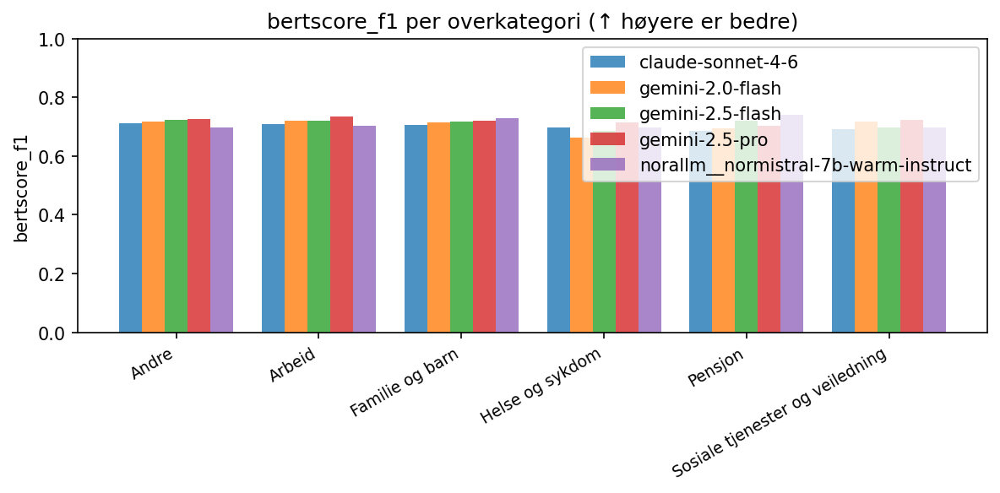

### cosine_similarity (↑ høyere er bedre)

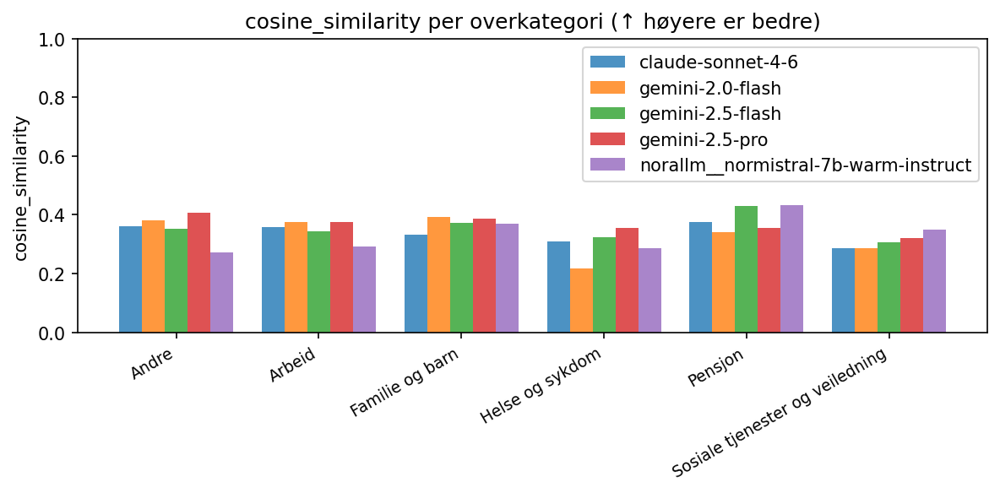

### jsd (↓ lavere er bedre)

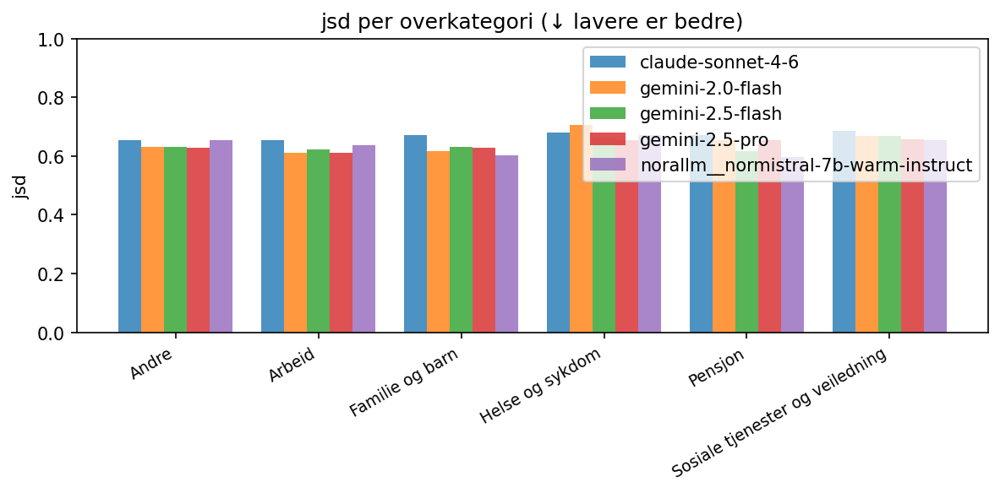

### nli_entailment (↑ høyere er bedre)

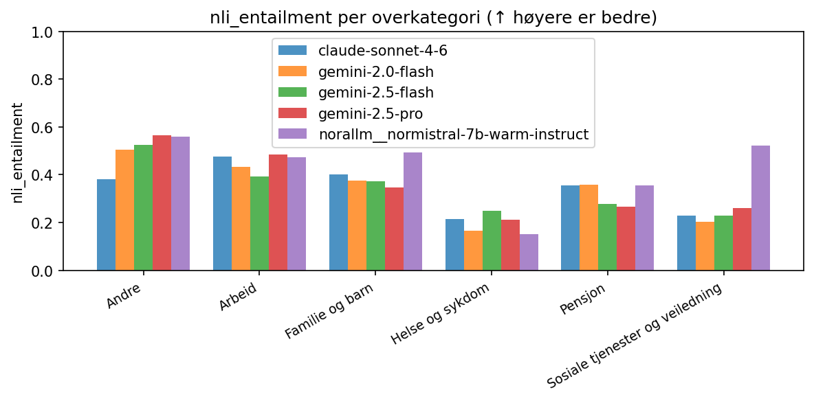

### rouge_l (↑ høyere er bedre)

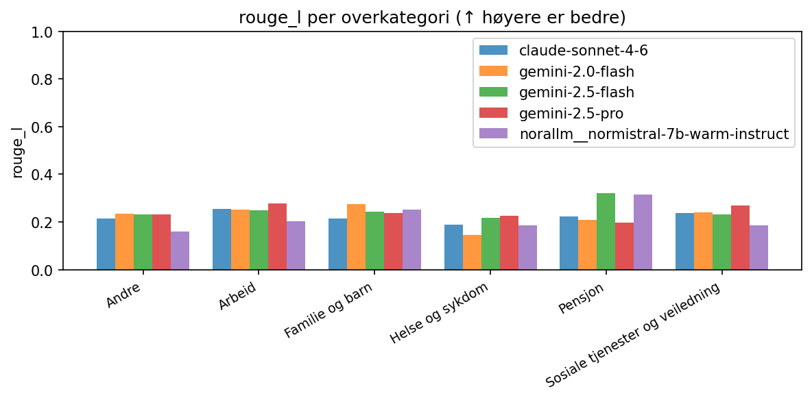

## Radarplott per overkategori

### Andre

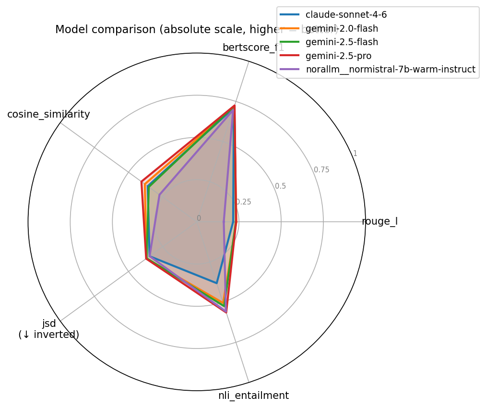

### Arbeid

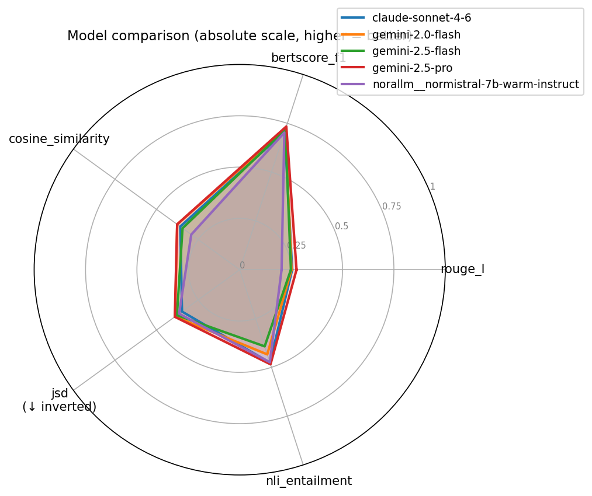

### Familie og barn

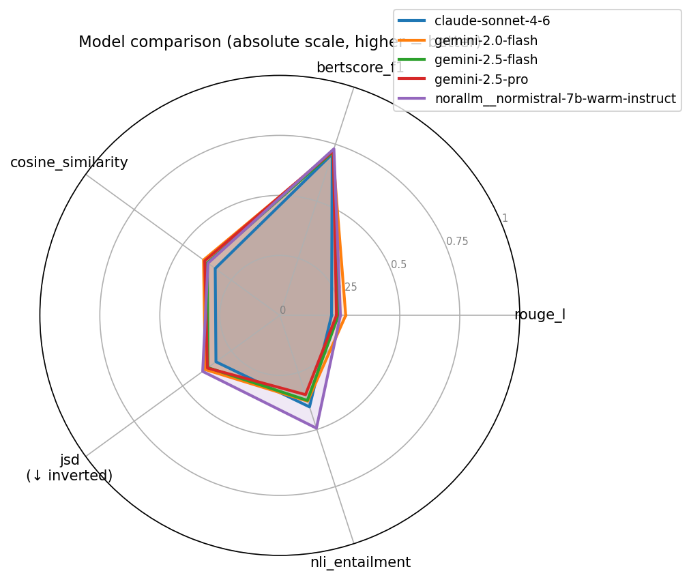

### Helse og sykdom

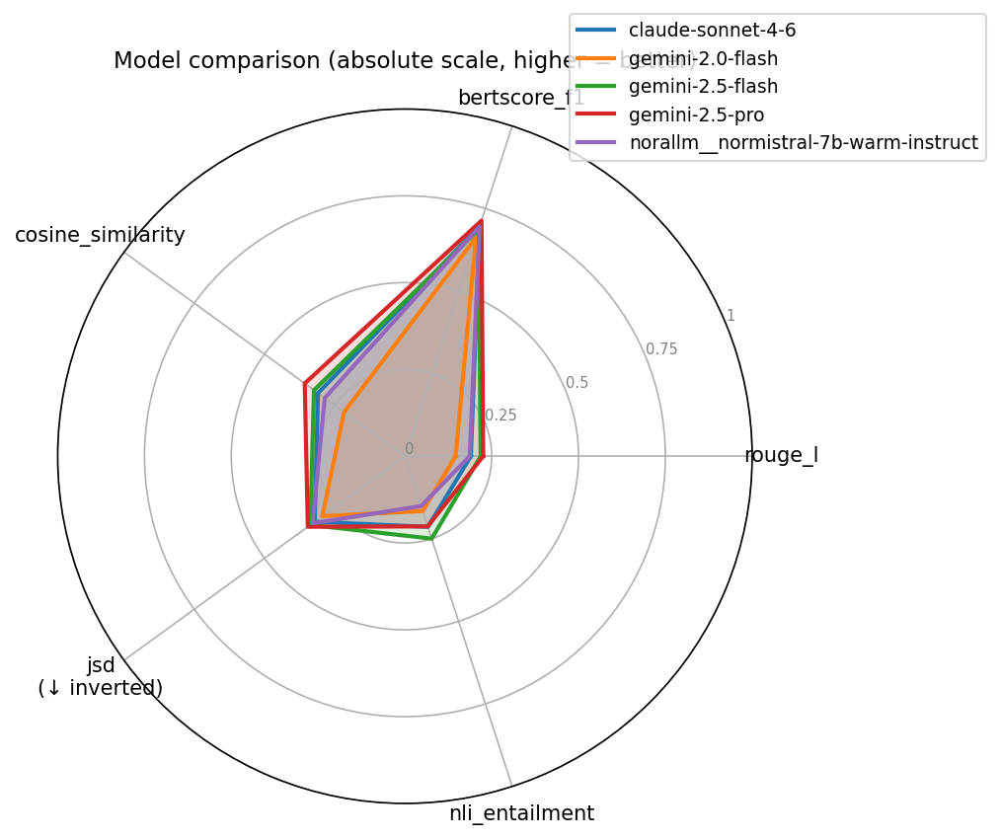

### Pensjon

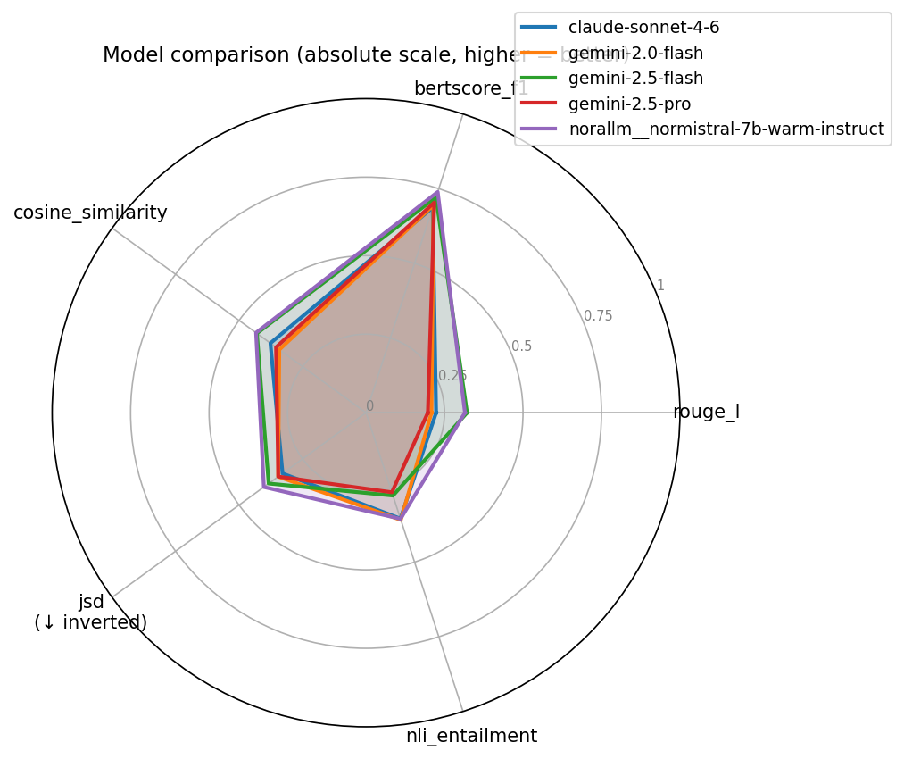

### Sosiale tjenester og veiledning

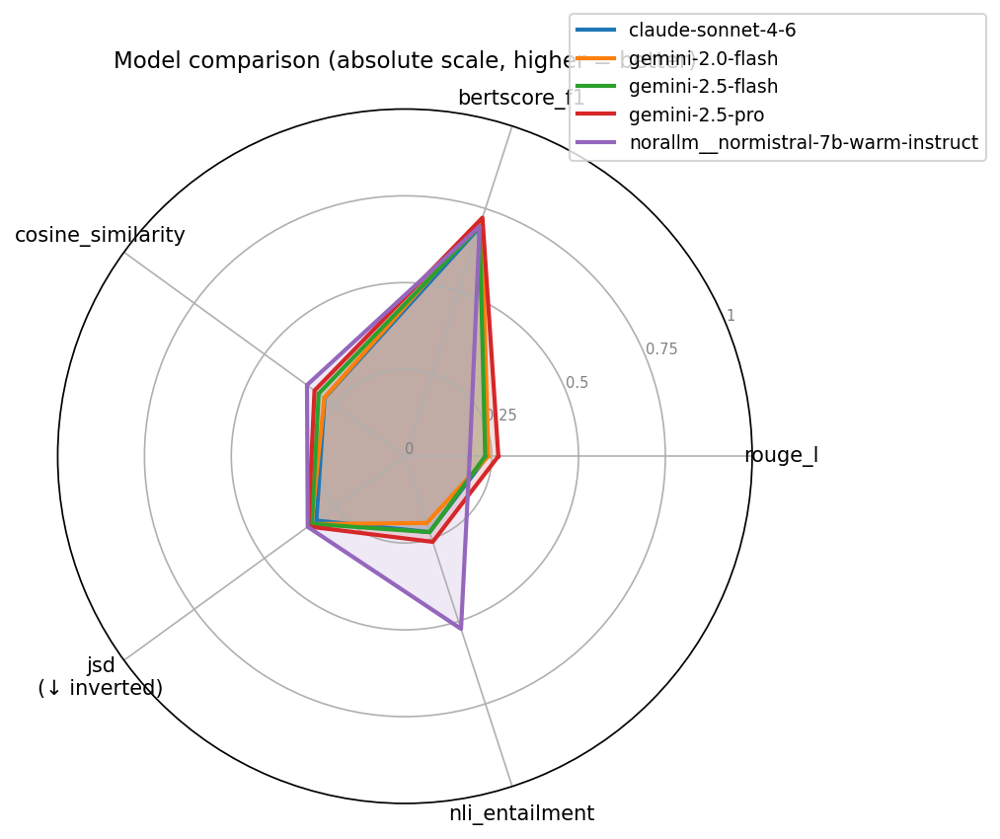
