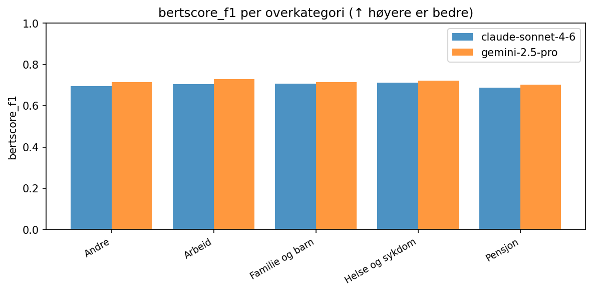
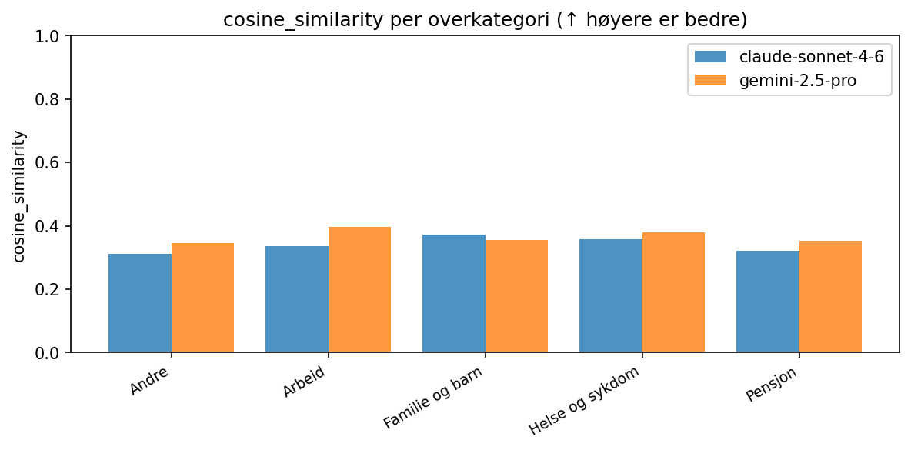
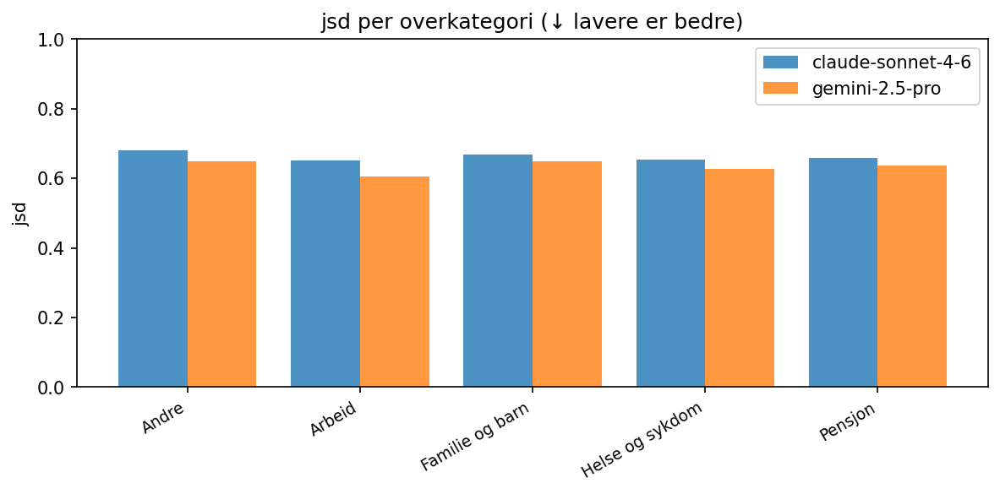
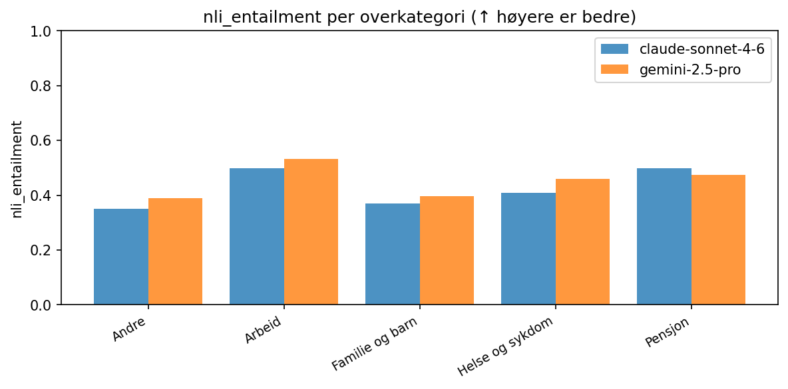
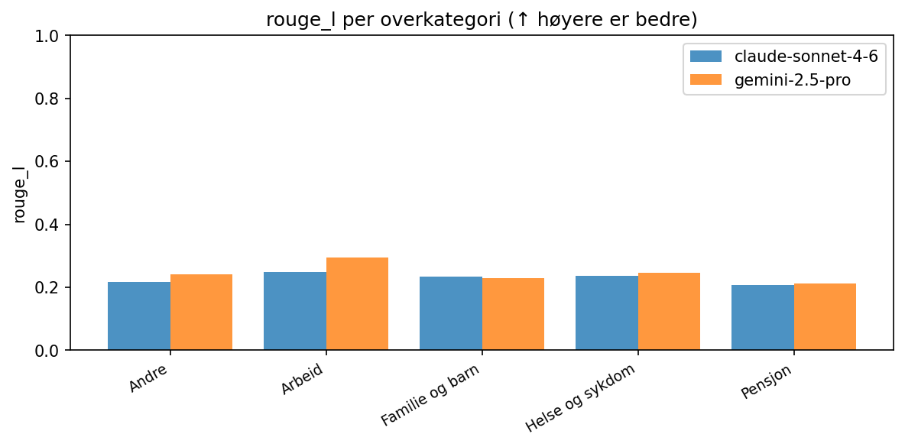
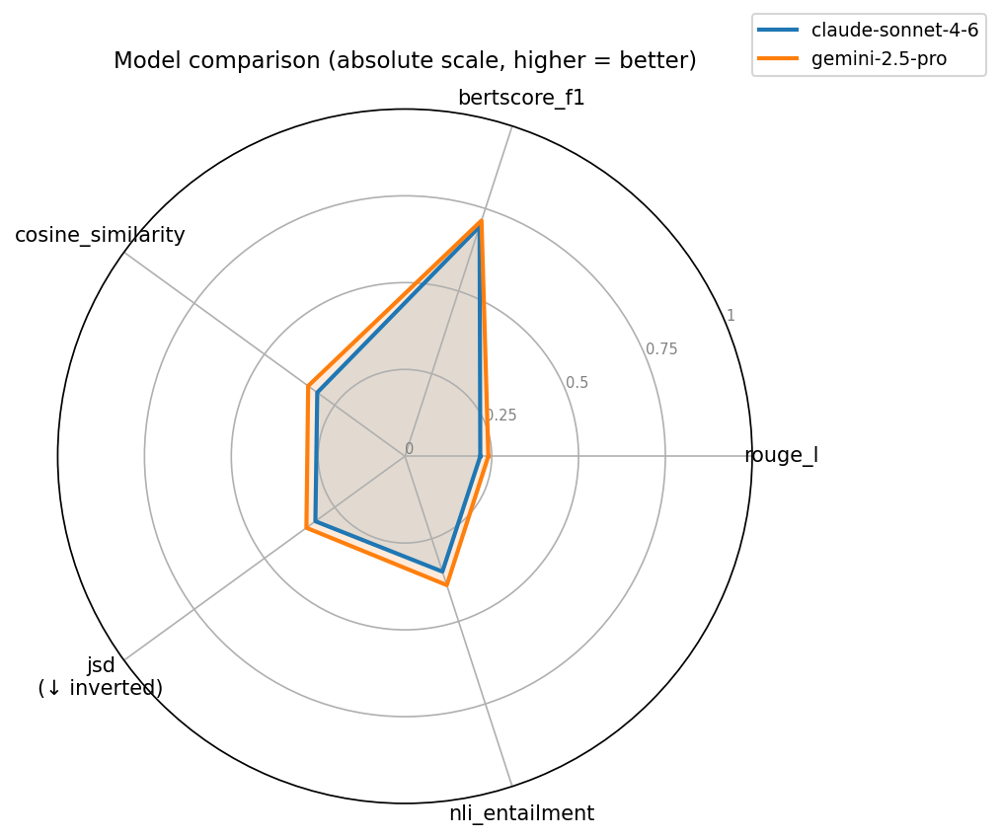
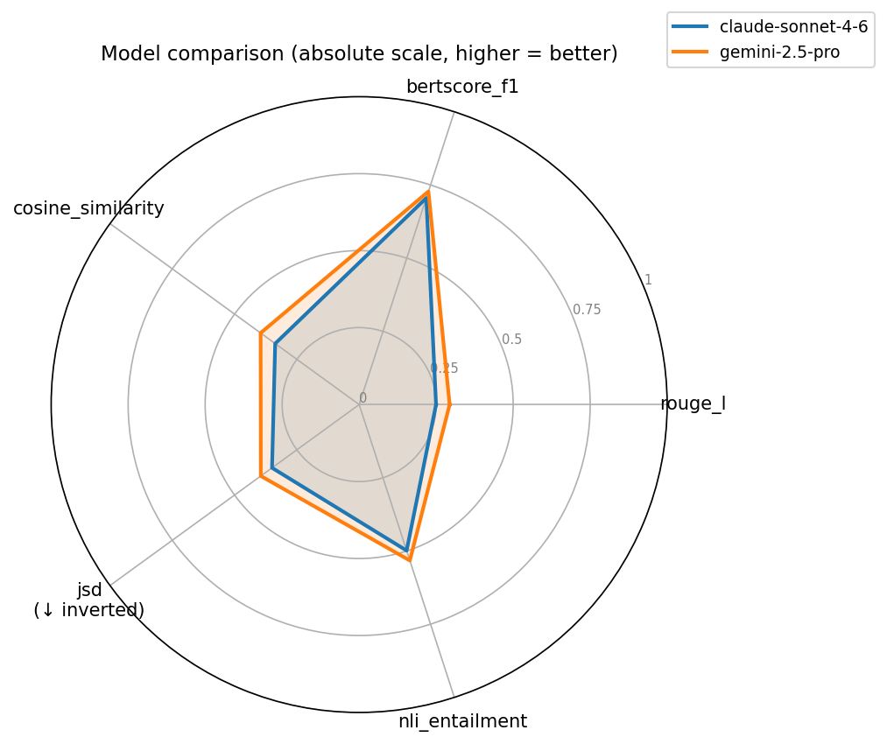
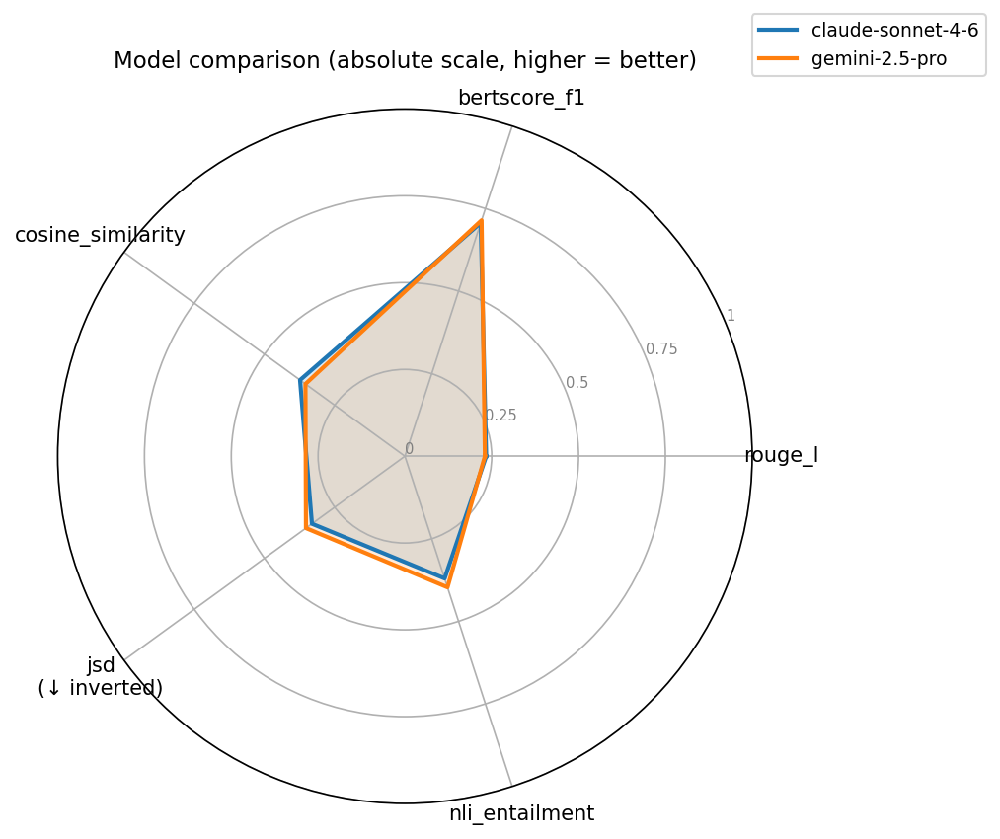
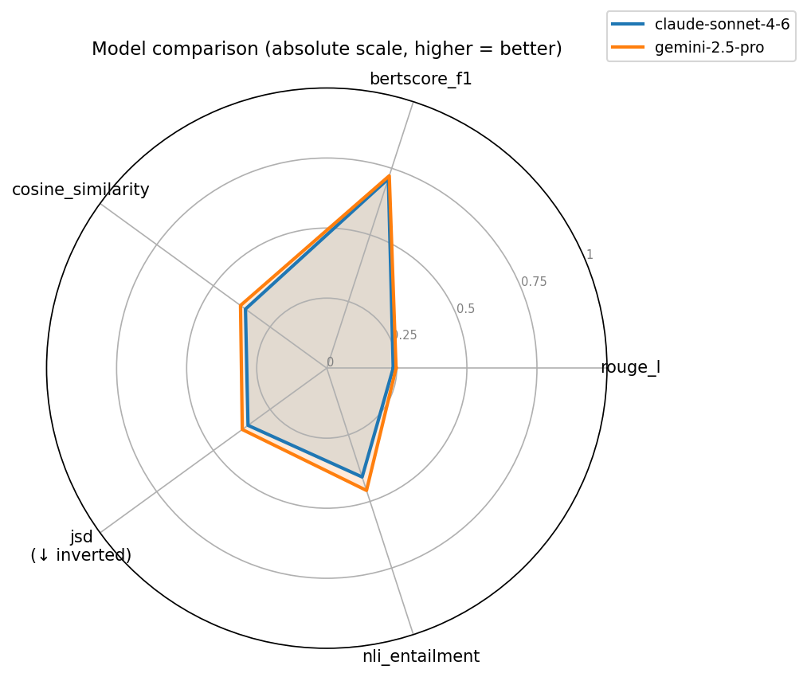
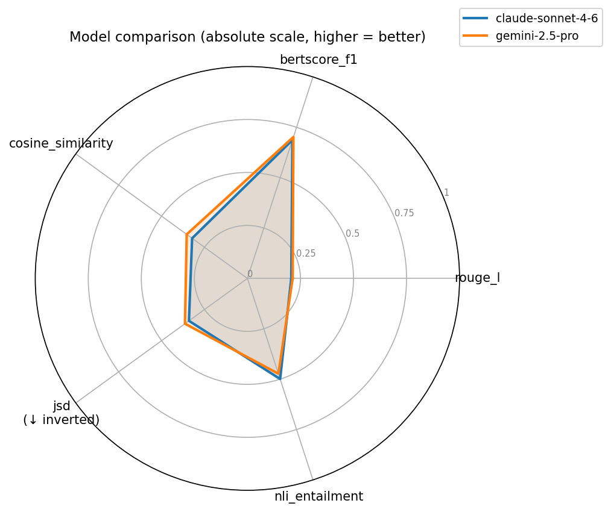

---
# Denne filen er autogenerert av src/report.py — ikke rediger manuelt
---

# Resultater per kategori

_Generert: 2026-06-25 13:45 UTC_

Denne siden viser evalueringsresultater gruppert etter **overkategori**.
Spørsmål kan tilhøre flere overkategorier, og inngår i beregningene for hver av dem.

## Tabeller per metrikk

### rouge_l

| Overkategori | claude-sonnet-4-6 | gemini-2.5-pro |
| --- | ---: | ---: |
| Andre | 0.2171 (n=40) | 0.2403 (n=40) ★ |
| Arbeid | 0.2496 (n=40) | 0.2938 (n=40) ★ |
| Familie og barn | 0.2340 (n=40) ★ | 0.2303 (n=40) |
| Helse og sykdom | 0.2370 (n=40) | 0.2473 (n=40) ★ |
| Pensjon | 0.2067 (n=6) | 0.2133 (n=6) ★ |

### bertscore_f1

| Overkategori | claude-sonnet-4-6 | gemini-2.5-pro |
| --- | ---: | ---: |
| Andre | 0.6958 (n=40) | 0.7137 (n=40) ★ |
| Arbeid | 0.7053 (n=40) | 0.7278 (n=40) ★ |
| Familie og barn | 0.7065 (n=40) | 0.7144 (n=40) ★ |
| Helse og sykdom | 0.7107 (n=40) | 0.7219 (n=40) ★ |
| Pensjon | 0.6870 (n=6) | 0.7019 (n=6) ★ |

### cosine_similarity

| Overkategori | claude-sonnet-4-6 | gemini-2.5-pro |
| --- | ---: | ---: |
| Andre | 0.3121 (n=40) | 0.3444 (n=40) ★ |
| Arbeid | 0.3370 (n=40) | 0.3954 (n=40) ★ |
| Familie og barn | 0.3732 (n=40) ★ | 0.3540 (n=40) |
| Helse og sykdom | 0.3586 (n=40) | 0.3805 (n=40) ★ |
| Pensjon | 0.3221 (n=6) | 0.3536 (n=6) ★ |

### jsd (↓ lavere er bedre)

| Overkategori | claude-sonnet-4-6 | gemini-2.5-pro |
| --- | ---: | ---: |
| Andre | 0.6813 (n=40) | 0.6493 (n=40) ★ |
| Arbeid | 0.6504 (n=40) | 0.6053 (n=40) ★ |
| Familie og barn | 0.6691 (n=40) | 0.6478 (n=40) ★ |
| Helse og sykdom | 0.6526 (n=40) | 0.6273 (n=40) ★ |
| Pensjon | 0.6594 (n=6) | 0.6363 (n=6) ★ |

### nli_entailment

| Overkategori | claude-sonnet-4-6 | gemini-2.5-pro |
| --- | ---: | ---: |
| Andre | 0.3494 (n=40) | 0.3903 (n=40) ★ |
| Arbeid | 0.4987 (n=40) | 0.5325 (n=40) ★ |
| Familie og barn | 0.3701 (n=40) | 0.3970 (n=40) ★ |
| Helse og sykdom | 0.4085 (n=40) | 0.4590 (n=40) ★ |
| Pensjon | 0.4991 (n=6) ★ | 0.4729 (n=6) |

## Søylediagram per overkategori

### bertscore_f1 (↑ høyere er bedre)

### cosine_similarity (↑ høyere er bedre)

### jsd (↓ lavere er bedre)

### nli_entailment (↑ høyere er bedre)

### rouge_l (↑ høyere er bedre)

## Radarplott per overkategori

### Andre

### Arbeid

### Familie og barn

### Helse og sykdom

### Pensjon

